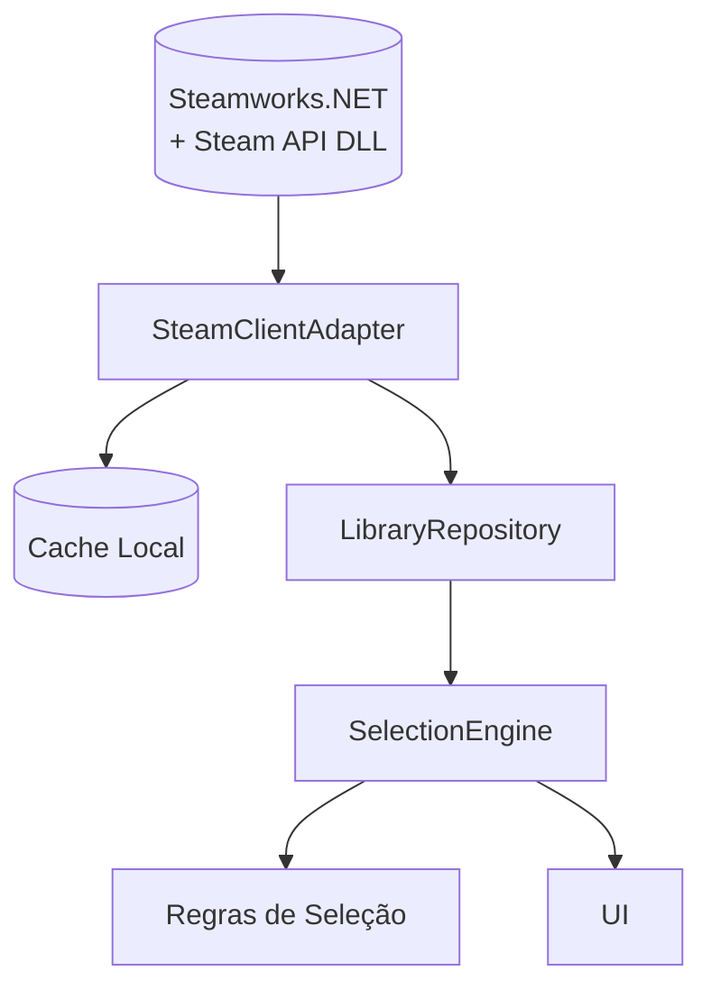

# Arquitetura do SteamBacklogPicker

## Justificativa Tecnológica
- **C#/.NET 8**: oferece suporte de primeira linha a APIs modernas, desempenho aprimorado e acesso facilitado ao ecossistema Steamworks. A linguagem e o runtime garantem integração nativa com bibliotecas Windows necessárias para comunicar-se com o cliente Steam e manipular DLLs de terceiros.
- **WPF (Windows Presentation Foundation)**: facilita a construção de interfaces desktop ricas e responsivas no Windows, com MVVM, data binding e recursos de composição gráfica necessários para exibir bibliotecas extensas de jogos e filtros avançados.

Essa combinação reduz a complexidade de interoperabilidade com APIs nativas, aproveita o suporte da Microsoft ao Windows Desktop e possibilita uma experiência de usuário fluida para quem executa o Steam localmente.

## Visão de Componentes

```mermaid
flowchart LR
    subgraph UI[Interface do Usuário (WPF)]
        View[Views XAML]
        ViewModel[ViewModels]
    end

    UI -->|Comandos, Bindings| SelectionEngine
    UI -->|Eventos de carregamento| LibraryRepository

    SelectionEngine -->|Solicita catálogo filtrado| LibraryRepository
    LibraryRepository -->|Consulta| SteamClientAdapter
    LibraryRepository -->|Consulta| EpicDiscovery[(Epic Manifest & Catalog Cache)]
    EpicDiscovery -->|Leitura local| EpicCaches[(%PROGRAMDATA%/%APPDATA% caches)]
    SteamClientAdapter -->|Dados de biblioteca| SteamAPI[(Steam Client / Steamworks.NET)]
```

### Detalhamento Interno



- **SteamClientAdapter**: abstrai chamadas à Steamworks.NET e converte respostas da Steam API para modelos internos.
- **EpicDiscovery**: reúne `EpicManifestCache` e `EpicCatalogCache`, lendo os manifestos `.item` e os caches `.json/.sqlite` do Epic Games Launcher para unificar as bibliotecas sem depender de chamadas online.
- **LibraryRepository**: provê operações de leitura e caching de dados da biblioteca, protegendo o restante do sistema de mudanças no esquema de dados bruto.
- **SelectionEngine**: aplica regras configuráveis (filtros, exclusões, prioridades) para escolher jogos candidatos e expõe resultados à camada de UI.
- **UI (WPF)**: apresenta a biblioteca filtrada, permite escolher critérios e exibe o jogo sorteado.

## Dependências Externas e Encapsulamento

| Dependência | Função | Estratégias de Encapsulamento |
|-------------|--------|--------------------------------|
| **Steamworks.NET** | Wrapper .NET para APIs do Steamworks, permitindo autenticação e consulta à biblioteca do usuário. | Encapsulado pelo `SteamClientAdapter`, que expõe interfaces internas independentes da biblioteca externa e centraliza tratamento de erros/interop. |
| **Steam API DLL (steam_api64.dll)** | Biblioteca nativa necessária pelo Steamworks.NET para comunicar com o cliente Steam. | Distribuída junto à aplicação, carregada indiretamente por Steamworks.NET; nunca referenciada diretamente pelo restante do código. O `SteamClientAdapter` valida presença e versão antes de inicializar. |
| **Epic Games Launcher caches** | Manifestos (`%PROGRAMDATA%\Epic\EpicGamesLauncher\Data\Manifests`) e catálogos (`%LOCALAPPDATA%\EpicGamesLauncher\Saved\Data\Catalog` ou `%APPDATA%\Epic\EpicGamesLauncher\Saved\Data\Catalog`). | Lidos exclusivamente pelos caches `EpicManifestCache` e `EpicCatalogCache`, que tratam diferenças de formato e mantêm watch de arquivos para refletir mudanças locais sem dependências de rede. |

## Garantias de operação offline

- Toda a coleta de dados ocorre em disco: se Steam ou Epic estiverem fechados, o aplicativo continua operando com os manifestos e catálogos armazenados nas pastas acima.
- Watchers de sistema de arquivos mantêm os caches sincronizados quando os launchers atualizam arquivos, sem abrir conexões externas.
- Preferências do usuário e histórico de sorteios residem em `%APPDATA%\SteamBacklogPicker`, garantindo que nenhuma decisão dependa de serviços externos.

Para reduzir acoplamento:
- Interfaces (`ISteamClientAdapter`, `ILibraryRepository`, `ISelectionEngine`) isolam cada componente e permitem testes com mocks.
- Tratamento de exceções e timeouts é concentrado no adaptador, evitando vazamento de detalhes de erro nativos.
- Os modelos de domínio usados por `SelectionEngine` e UI são definidos no projeto principal, mantendo invariantes consistentes independentemente das mudanças no fornecedor da API.

## Próximos Passos Arquiteturais
- Implementar camadas de testes unitários focadas em `SelectionEngine` e mocks do `LibraryRepository`.
- Adicionar telemetria mínima para diagnosticar falhas de inicialização da Steam API.
- Planejar suporte multiplataforma futuro (ex.: Avalonia) mantendo a lógica de domínio desacoplada da UI.
