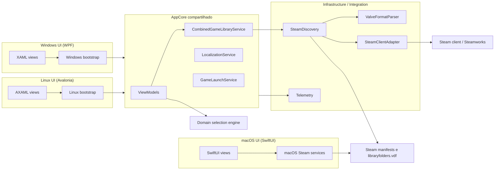

# Arquitetura do SteamBacklogPicker

## Justificativa tecnológica

- **C#/.NET 8**: mantém domínio, parsing de manifests e integrações locais em uma base testável e multiplataforma.
- **WPF no Windows**: entrega a experiência nativa Windows e integrações específicas como notificações e atualização via Squirrel quando o app está instalado nesse formato.
- **Avalonia no Linux**: reutiliza AppCore e domínio, mantendo uma UI desktop Linux sem duplicar regras de seleção, localização ou leitura da biblioteca. O release Linux usa AppImage nativo quando `appimagetool` está disponível no CI.
- **SwiftUI no macOS**: entrega cliente nativo macOS em SwiftPM, portando as mesmas jornadas visíveis com leitura local da Steam, coleções e ações `steam://`.

O projeto é offline-first: a biblioteca é descoberta a partir de arquivos locais do Steam e do cliente Steam instalado, sem depender de serviços em nuvem.

## Visão de componentes

```mermaid
flowchart LR
    subgraph Windows["Windows UI (WPF)"]
        WpfView["XAML views"]
        WpfBootstrap["Windows bootstrap"]
    end

    subgraph Linux["Linux UI (Avalonia)"]
        LinuxView["AXAML views"]
        LinuxBootstrap["Linux bootstrap"]
    end

    subgraph Mac["macOS UI (SwiftUI)"]
        MacView["SwiftUI views"]
        MacServices["macOS Steam services"]
    end

    subgraph AppCore["AppCore compartilhado"]
        ViewModels["ViewModels"]
        LibraryService["CombinedGameLibraryService"]
        Localization["LocalizationService"]
        Launch["GameLaunchService"]
    end

    subgraph Infrastructure["Infrastructure / Integration"]
        Discovery["SteamDiscovery"]
        Parser["ValveFormatParser"]
        Adapter["SteamClientAdapter"]
        Telemetry["Telemetry"]
    end

    Domain["Domain selection engine"]
    SteamFiles["Steam manifests e libraryfolders.vdf"]
    SteamClient["Steam client / Steamworks"]

    WpfView --> WpfBootstrap --> AppCore
    LinuxView --> LinuxBootstrap --> AppCore
    MacView --> MacServices
    MacServices --> SteamFiles
    ViewModels --> Domain
    ViewModels --> LibraryService
    LibraryService --> Discovery
    Discovery --> Parser
    Discovery --> SteamFiles
    Discovery --> Adapter
    Adapter --> SteamClient
    AppCore --> Telemetry
```

## Responsabilidades por camada

- **Domain**: modelos imutáveis, preferências, histórico e regras de seleção. Não faz I/O.
- **SteamDiscovery**: localiza instalações Steam, lê `libraryfolders.vdf`, acompanha manifests `appmanifest_*.acf` e mantém cache de jogos.
- **SteamClientAdapter**: isola Steamworks.NET, fallback de VDF do Steam e ciclo de vida da API nativa.
- **ValveFormatParser**: faz parsing dos formatos Valve usados por SteamDiscovery e SteamClientAdapter.
- **Telemetry**: registra diagnósticos locais quando habilitado.
- **AppCore**: contém ViewModels, serviços compartilhados de biblioteca, localização, arte, lançamento e contratos de UX.
- **SteamBacklogPicker.UI**: WPF, notificações/atualização Windows e bootstrap específico do Windows.
- **SteamBacklogPicker.Linux**: Avalonia, notificações/atualização Linux e bootstrap específico do Linux.
- **SteamBacklogPicker.Mac**: SwiftUI, descoberta local da Steam em macOS, coleções, arte, fallback de nomes e notificações nativas opcionais.

## Encapsulamento de dependências externas

| Dependência | Função | Estratégia |
| --- | --- | --- |
| Steamworks.NET | Consulta capacidades do cliente Steam quando disponível. | Isolado por `ISteamClientAdapter`; falhas retornam fallback seguro. |
| Steam API nativa | Inicialização e chamadas locais do Steam client. | Carregamento e reset ficam no adapter; consumidores usam contratos internos. |
| Arquivos Steam (`libraryfolders.vdf`, `appmanifest_*.acf`) | Fonte principal da biblioteca offline. | Lidos por `SteamDiscovery` com comparação de caminho por plataforma e testes de fixture. |
| Avalonia | UI Linux. | Restrita ao projeto Linux; ViewModels ficam em AppCore. |
| Tmds.DBus.Protocol | Notificações Freedesktop no Linux. | Restrito ao projeto Linux; falhas são opcionais e não interrompem o sorteio. |
| WPF/Squirrel | UI e update Windows. | Restritos ao projeto Windows; Squirrel legado exige opt-in até existir Authenticode/pinning. |

## Garantias de operação offline

- A descoberta de biblioteca usa apenas Steam local e arquivos em disco.
- Preferências e histórico ficam no diretório local do app.
- Watchers atualizam o cache quando manifests mudam, mas falhas transitórias preservam o último estado válido.
- Updates Linux aceitam feeds assinados por RSA SHA-256; feeds sem assinatura exigem opt-in explícito para teste local.
- Updates Windows via Squirrel ficam desativados por padrão enquanto não houver verificação independente de autenticidade.
- Linux e Windows compartilham as mesmas regras de domínio e seleção via AppCore; macOS espelha essas regras em SwiftUI/Swift para manter o cliente nativo sem runtime .NET.

## Fluxo de bootstrap

1. O projeto de plataforma chama os registros compartilhados de AppCore.
2. AppCore registra domínio, parsing, descoberta Steam, biblioteca combinada, localização e ViewModels.
3. O projeto de plataforma registra apenas serviços UX específicos: notificações e update.
4. A janela principal resolve `MainViewModel` pelo provedor de DI.

## Próximos passos arquiteturais

- Provisionar chaves oficiais para assinatura do feed Linux e assinatura Authenticode/pinning no Windows.
- Validar empacotamento/update em ambiente Linux real de release.
