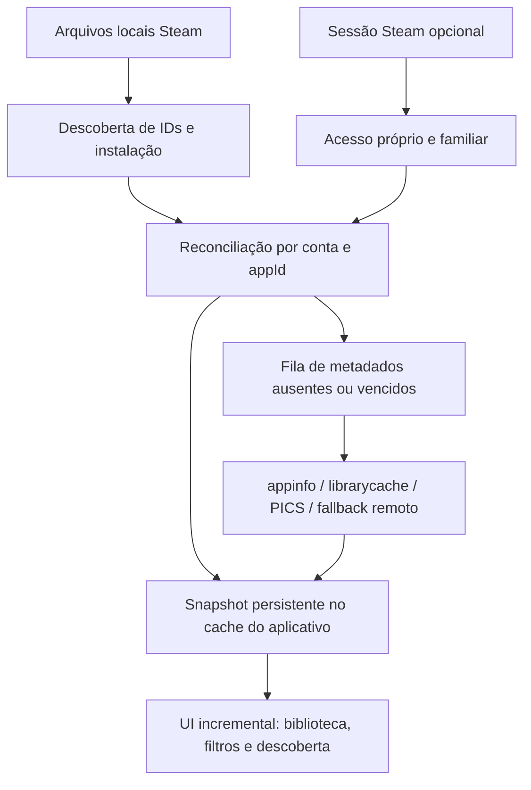

# Steam Family e cache: proposta de implementação

Data: 6 de setembro de 2026. Base: revisão c45eb915f63b0855988eca9d9c1bcb01dc42b86e.

## Decisão recomendada

Manter um modo local sem login e acrescentar uma integração Steam autenticada opcional. O aplicativo deve manter seu próprio catálogo persistente, enriquecido em segundo plano.

Há dois problemas independentes:

1. **Descoberta de acesso:** quais appIds pertencem à conta ou podem ser acessados pela família?
2. **Enriquecimento:** quais são os nomes, imagens, tipos, plataformas e outros atributos desses appIds?

Ter metadados de um jogo não demonstra que a pessoa o possui. Ter uma licença não demonstra que o jogo está instalado. Ter acesso familiar não demonstra que há uma cópia livre neste instante.

## Fontes e seus limites

| Fonte | Serve para | Não permite concluir sozinha | Papel sugerido |
| --- | --- | --- | --- |
| appmanifest_*.acf e bibliotecas locais | Evidência de instalação/estado local | Licença atual ou toda a família | Instalação por dispositivo |
| localconfig, coleções e librarycache | IDs conhecidos, histórico e metadados locais | Propriedade, completude ou instalação na ausência de flag | Descoberta parcial e enriquecimento |
| appinfo.vdf | Catálogo conhecido pelo cliente | Jogos possuídos ou autorizados | Enriquecimento local |
| GetOwnedGames | Jogos da conta conforme acesso/visibilidade da Web API | Biblioteca familiar completa | Fonte opcional de jogos próprios |
| SteamKit / FamilyGroups | Candidato para consultar biblioteca familiar autenticada e exclusões | Contrato público estável ou cópias livres em tempo real | Prova de viabilidade e provider isolado |
| SteamKit / PICS | Metadados de apps/pacotes, conforme acesso disponível | Direito de jogar | Enriquecimento por IDs já descobertos |
| Store appdetails/CDN | Complemento de nomes, imagens e atributos disponíveis | Licença, instalação ou disponibilidade familiar | Fallback limitado e cacheado |
| SteamCMD | Possível apoio técnico a consultas de metadados | Solução pronta de Steam Families | Alternativa experimental, sem prioridade |

GetOwnedGames tem parâmetros e requisitos próprios; não deve ser apresentado como catálogo familiar universal. [IPlayerService](https://partner.steamgames.com/doc/webapi/IPlayerService).

A documentação Steamworks diferencia instalação e propriedade, e BIsSubscribedFromFamilySharing consulta o aplicativo corrente. O GetAppOwner relacionado também tem esse contexto. Não é uma operação para percorrer arbitrariamente os jogos da família. [ISteamApps](https://partner.steamgames.com/doc/api/ISteamApps).

## Oportunidade concreta com SteamKit

O csproj do adapter já referencia SteamKit2 3.3.1. A auditoria não encontrou uso de suas APIs no código de produção. Por reflexão na biblioteca restaurada foram confirmados os tipos:

- SteamKit2.Internal.CFamilyGroups_GetSharedLibraryApps_Request
- SteamKit2.Internal.CFamilyGroups_GetSharedLibraryApps_Response
- SteamKit2.Internal.FamilyGroups

Os schemas publicados contêm GetFamilyGroupForUser e GetSharedLibraryApps. A consulta de biblioteca inclui campos de grupo, idioma, inclusão de jogos próprios/excluídos e usuário. A resposta tem appId, nome, proprietários e motivo de exclusão, entre outros dados. Isso sustenta uma hipótese de integração bem mais direta que inferir compartilhamento por caches locais. [Schema FamilyGroups](https://raw.githubusercontent.com/SteamDatabase/Protobufs/master/steam/steammessages_familygroups.steamclient.proto).

**Limite da conclusão:** os tipos existem na dependência e no protocolo inspecionado. Não foi feita autenticação real nem comprovada uma chamada bem-sucedida nesta auditoria. SteamKit é uma biblioteca de interoperabilidade, e esse protocolo não equivale a um contrato público estável da Web API. Isolar mudanças e falhas no provider. Conferir requisitos do release escolhido; o master atual do SteamKit exige .NET 10, enquanto o projeto auditado é .NET 8. [SteamKit](https://github.com/SteamRE/SteamKit).

### Prova de viabilidade antes de implementar a tela completa

1. Criar um pequeno utilitário isolado usando uma versão fixada e compatível.
2. Usar um fluxo de autenticação explicitamente iniciado pela pessoa, com Steam Guard conforme suportado. Não reutilizar cookies ou credenciais extraídos do cliente Steam.
3. Obter a identidade da conta autenticada e consultar seu grupo familiar.
4. Consultar a biblioteca compartilhada; tratar erros de autorização, grupo ausente, exclusões, duplicação de proprietários e limites de resposta.
5. Comparar uma amostra e a contagem com o cliente Steam, incluindo um jogo de familiar que nunca foi instalado ou aberto nesta máquina.
6. Simular desconexão, sessão expirada, troca de conta, jogo removido e resposta parcial.
7. Exportar apenas um resultado sanitizado de comparação e decidir se a integração atende ao produto.

Aceite: jogos familiares não vistos localmente aparecem; IDs próprios/familiares não duplicam; exclusões não são vendidas como acesso; uma falha de rede preserva a biblioteca anterior com indicador de desatualização.

Disponibilidade de cópia é separada. O schema inclui notificações de apps em execução; ainda seria necessário testar sua semântica, ciclo de vida e atualização. Até isso estar implementado, usar “Acesso pela família” e “Disponibilidade a confirmar no Steam”. [Mensagens FamilyGroups](https://raw.githubusercontent.com/SteamDatabase/Protobufs/master/steam/steammessages_familygroups.steamclient.proto).

## Modelo de domínio proposto

| Entidade | Campos essenciais |
| --- | --- |
| AppMetadata | appId, idioma, título, tipo, plataformas, atributos, fonte, observadoEm, expiraEm |
| AccountAccess | accountId, appId, próprio/familiar/desconhecido, ownerIds, elegibilidade, motivo, fonte, observadoEm |
| LocalInstallation | deviceId, libraryId, appId, instalado/não instalado/desconhecido, caminho, evidência, observadoEm |
| FamilyAvailability | accountId, appId, disponível/ocupado/desconhecido, observadoEm |
| BacklogEntry | accountId, appId, quero jogar/jogando/concluído/oculto/adiado, preferência local |
| LibrarySnapshot | accountId, geração, fontes concluídas/parciais/falhas, horário, contagens |
| SyncJob | chave deduplicável, prioridade, tentativas, próxima tentativa, estado |
| Artwork | appId, variante, URL/fonte, caminho local, validade, tamanho |

Armazenamento sugerido: SQLite com migrações, transações e índices nas chaves de consulta. Metadados públicos podem ser compartilhados entre contas; direitos, histórico e backlog devem permanecer no escopo correto. Segredos de sessão pertencem ao armazenamento seguro do sistema operacional, fora dessas tabelas e dos logs.

Começar pequeno: título/tipo, evidência de acesso, instalação e snapshot. Não é necessário implementar todas as entidades avançadas para corrigir os bugs atuais.

## Fluxo de sincronização

Ao abrir, renderizar o último snapshot rapidamente e iniciar uma atualização em segundo plano. Uma falha parcial não deve apagar dados íntegros nem converter a falta de resposta em “nenhum jogo”.

### Como popular o cache automaticamente

- **Priorizar o que importa:** título e arte do jogo selecionado, cards visíveis e candidatos próximos; completar o restante quando o aplicativo estiver ocioso.
- **Deduplicar:** uma tarefa por appId/idioma/fonte, com batches onde a API suportar.
- **Limitar concorrência:** começar conservador, medir latência e erros e ajustar. Um número escolhido no código não deve ser apresentado como limite oficial da Valve.
- **Retentar corretamente:** backoff exponencial com jitter, Retry-After quando existir e interrupção temporária após falhas repetidas.
- **Guardar ausências:** cache negativo com prazo menor para títulos removidos ou respostas indisponíveis; não consultar o mesmo ID sem parar.
- **Controlar validade:** política distinta para título/capa, acesso familiar e instalação. Eventos locais atualizam instalação; direitos exigem reconciliação autenticada.
- **Cancelar e retomar:** fechar a tela ou trocar de conta invalida a geração anterior. Jobs persistidos podem continuar numa próxima abertura.
- **Preservar escolhas:** enriquecimento de metadata nunca sobrescreve “Concluído”, “Oculto” ou preferências do usuário.
- **Conter o custo:** limites de disco/LRU para imagens, validação de formatos e dimensões, limites de resposta e descompressão.

Essa automação funciona dentro do aplicativo durante abertura/uso ocioso e via botão “Sincronizar agora”. Um processo separado recorrente só se justifica depois de medir necessidade. Esta auditoria não criou tarefa agendada.

Eu não usaria automação de cliques na biblioteca Steam para “esquentar” o cache como integração principal. Ela depende da tela e do estado do cliente, interfere com o uso e não fornece uma prova de completude. Também não escreveria appinfo ou outros caches mantidos pelo Steam. Um cache do próprio programa permite recuperação, migração e diagnóstico sem depender de adulterar a fonte.

## UX de confiança e diagnóstico

Exibir conta selecionada e identidade da conta conectada. A conta MostRecent do arquivo local é uma escolha inicial possível, não confirmação de que a pessoa quer usar aquela conta.

Mostrar mensagens específicas:

- “Biblioteca local carregada; alguns jogos da família podem estar ausentes.”
- “Sincronizado há 8 minutos.”
- “100 títulos aguardando atualização.”
- “Conexão expirada; exibindo a última biblioteca sincronizada.”
- “Este jogo é da família; a disponibilidade será confirmada pelo Steam.”

Esses textos são exemplos de estados propostos, não funcionalidades existentes. Contagens devem derivar do snapshot real. Separar “jogos conhecidos”, “com acesso confirmado” e “elegíveis para este filtro”.

Um painel de diagnóstico pode explicar, para cada appId, quais fontes contribuíram com nome, acesso e instalação. Exportar diagnóstico sanitizado facilita tratar bibliotecas ausentes sem pedir cópias inteiras de perfis Steam.

## Descoberta que ajuda a decidir

Primeira evolução: manter um sorteio uniforme opcional e acrescentar uma política sem repetição no ciclo atual, histórico visível e estados de backlog. Não inferir que um jogo foi concluído apenas pelo tempo de uso.

Depois, oferecer até três sugestões por vez, com motivos verificáveis: “já instalado”, “você marcou para jogar”, “ainda não jogado”, “da sua coleção de RPG”. Se o histórico ou metadado não for conhecido, omitir o motivo correspondente.

Gênero, duração, multiplayer e compatibilidade podem virar presets quando houver dados confiáveis. “Não suportado” e “desconhecido” precisam ser valores diferentes. Não depender de um modelo de IA para resolver a camada básica de recomendação; uma regra simples, configurável e explicável atende melhor à primeira versão.

## Testes e métricas de aceite

- Instalação: ausência de Installed, manifest válido, manifest parcial, múltiplas bibliotecas, disco removido, atualização em curso.
- Acesso: próprio, familiar, desconhecido, revogado, excluído, duplicado entre membros, conta trocada.
- Cache: idioma alterado, TTL vencido, 429, timeout, arquivo corrompido, resposta truncada, app removido, retomada após encerramento.
- Concorrência: refresh repetido, callbacks atrasados e troca de conta durante download.
- UI: lista vazia versus filtros vazios, título/capa ausentes, offline e ações corretas para cada estado.
- Paridade: mesma fixture sanitizada deve produzir a mesma interpretação em .NET e Swift.
- Métricas: cobertura de títulos, entradas por fonte, latência até conteúdo útil, tempo de refresh, taxa de cache hit e erros por provider. Medir localmente; telemetria remota, se adicionada, exige uma decisão separada.

Metas iniciais propostas para um conjunto de referência controlado: zero falsos instalados nas fixtures; nenhum dado de conta anterior após troca; todos os IDs familiares elegíveis da comparação aparecem; interface continua utilizável durante sincronização. Definir metas numéricas de desempenho depois de medir bibliotecas pequenas, médias e grandes em hardware representativo.

[Auditoria completa e prioridades](<AUDITORIA.md>).
