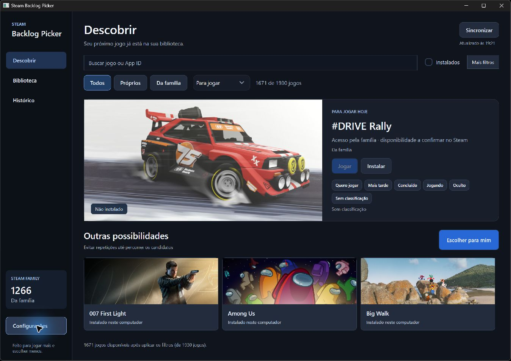
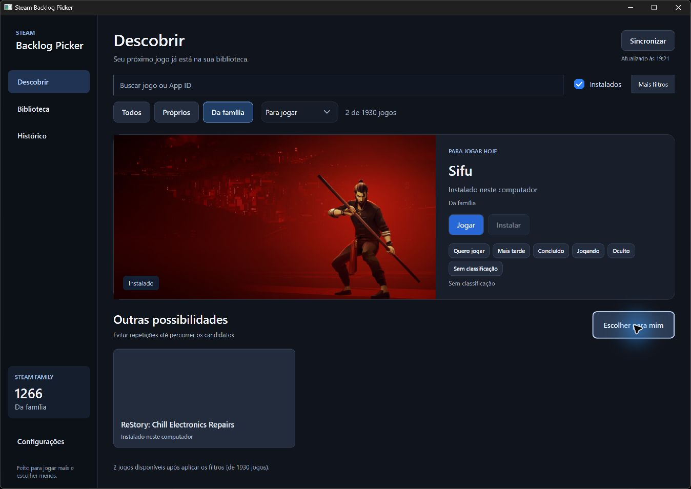
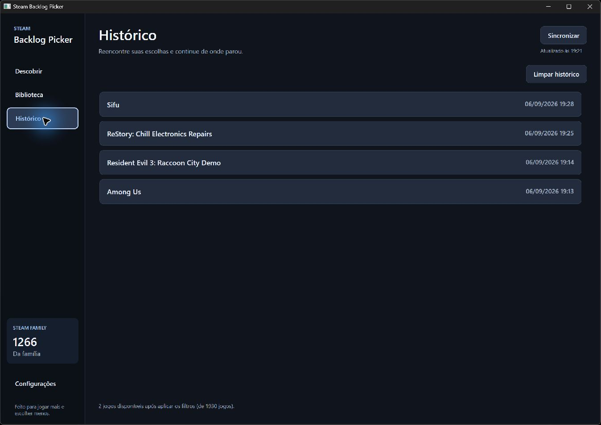
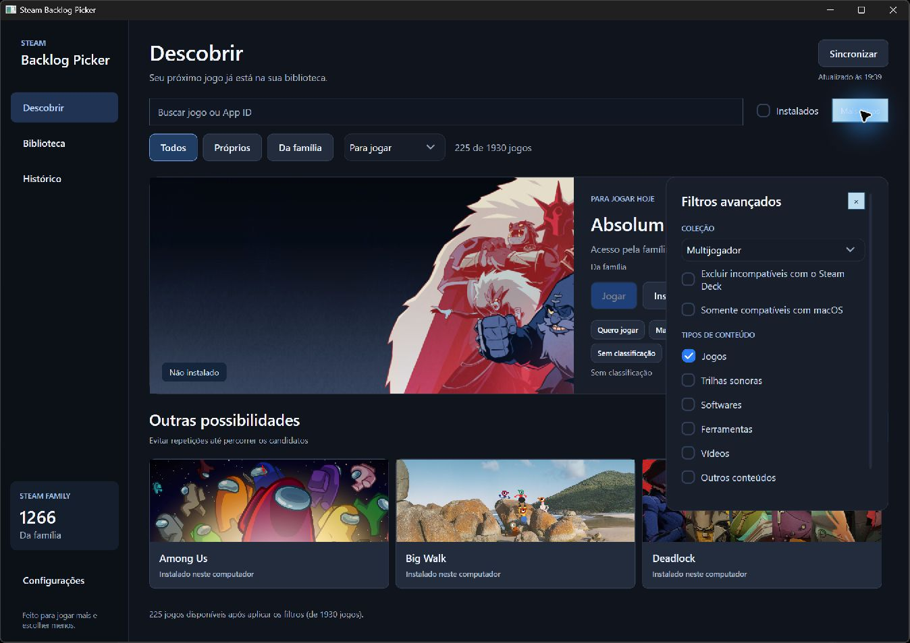

# Implementação e validação — 6 de setembro de 2026

Esta entrega implementa as correções da [auditoria inicial](../../audit/2026-09-06/AUDITORIA.md), com três agentes trabalhando em descoberta/robustez, catálogo/sincronização e plataformas/distribuição. A integração e os testes da aplicação Windows foram feitos na tarefa principal. O repositório permanece com alterações locais para revisão; nenhuma release foi publicada no GitHub.

## Resultado observado no computador

| Medida | Auditoria inicial | Depois das correções |
| --- | ---: | ---: |
| Entradas conhecidas | 451 | 575 locais; 1.930 após sincronização familiar |
| Marcadas instaladas | 444 | 14, compatíveis com os manifests encontrados |
| Entradas classificadas como familiares | 0 | 1.266 |
| Títulos ainda no formato App ID | 100 | 24 na leitura observada |

Esses números descrevem este computador e esta sessão. Entradas conhecidas incluem registros de tipos diferentes e não equivalem ao número de licenças compradas. Filtros de conteúdo e backlog reduzem os candidatos. Metadados continuam sendo enriquecidos em segundo plano.

O fluxo autenticado retornou dados reais: a janela apresentou Conectar desabilitado, Desconectar habilitado, progresso da sincronização e os totais acima. A aprovação da autenticação não foi automatizada. Nenhum QR, token, senha, identidade de familiar ou SteamID pessoal foi incluído nas evidências salvas deste relatório.

Uma segunda instância iniciada a partir do pacote portátil, com DOTNET_ROOT removido de seu ambiente, recuperou as mesmas 1.930 entradas e 1.266 familiares pelo cache. Isso verifica inicialização com runtime incluído e reaproveitamento do cache; não significa que uma nova sessão autenticada tenha sido persistida.

## O que mudou

| Achados | Correção entregue |
| --- | --- |
| F01–F02 | Instalação, propriedade e compartilhamento separados. Ausência de flag não significa instalado. LastOwner não comprova licença. Filtro e ações usam a mesma informação de instalação. |
| F03 | Removida a inicialização automática da DLL Steamworks sem contexto de aplicativo. Enumeração familiar implementada por sessão QR e FamilyGroups do SteamKit, sem tratar a API do aplicativo corrente como enumeração de outras licenças. |
| F04 | Suítes Linux e catálogo incluídas na solução/CI; restore do RID antes do publish; skips Linux reais em Windows. Relatório TRX conta resultados NotExecuted, pois o contador agregado pode permanecer zero. |
| F05–F06 | Identidade e geração de sincronização, cancelamento, descarte de resultados tardios, snapshots atômicos, atualização fora da UI e preservação da biblioteca após falha. Coleção escolhida permanece selecionada durante atualizações incrementais. |
| F07 | Nomes do JSON local, PICS e loja; SQLite por AppID/idioma, TTL positivo/negativo, limites de concorrência, retries e backoff. Falha temporária não vira jogo inexistente. |
| F08–F09 | Nova UI WPF/Avalonia com navegação, busca, estados vazios, filtros, detalhes, biblioteca virtualizada, foco/atalhos, nomes acessíveis e contraste melhorado. |
| F10 | Contratos de instalação/Deck/DLC/VR alinhados e parsers Swift reforçados; zstd oficial fixado. A nova UI e o catálogo SteamKit ainda são específicos de Windows/Linux. |
| F11–F12 | Novas regressões de instalação, conta, revogação, cache, cancelamento, truncamento e persistência; testes Avalonia com controles reais. Telemetria opcional não bloqueia startup por falha no destino. |
| F13 | ZIP Windows com runtime, checksum e script reproduzível; updater Linux revalida arquivo pendente; ferramentas AppImage fixadas; pacote macOS de desenvolvimento. |
| F14 | Backlog por conta, desfazer, histórico limitado a 200, preferência persistida para evitar repetições e sugestões com justificativa baseada nos dados disponíveis. |
| F15 | README e changelog descrevem recursos reais por plataforma, modos de rede, autenticação, cache e limites de distribuição. |

O cache é do Backlog Picker. A aplicação não popula nem modifica os arquivos internos de autenticação/cache do cliente Steam. Informações familiares expiram em 30 minutos; resultados antigos podem manter títulos para consulta, mas não viram comprovação atual de acesso. Logout/revogação invalidam os direitos correspondentes. A disponibilidade de uma cópia continua sendo confirmada pelo Steam.

## Testes com computer use

Foi usada a interface nativa Windows com capturas e árvore de acessibilidade, além dos testes automatizados. Foram verificados:

- Abertura da aplicação com dados reais e renderização da nova interface.
- Ctrl+F, busca por título, biblioteca com resultado único e abertura da prévia do Among Us.
- Among Us instalado: Jogar habilitado e Instalar desabilitado.
- Marcar Quero jogar e Desfazer, retornando a Sem classificação.
- Sorteio e navegação do histórico.
- Consulta familiar real e classificação de The Wolf Among Us como familiar não instalado.
- Filtro Da família combinado com Instalados: dois candidatos neste computador, incluindo ReStory e Sifu; Jogar habilitado sem perder o rótulo familiar.
- Abertura do pacote portátil e recuperação do cache entre processos.
- Seleção da coleção Multijogador, preservada após atualização incremental e sincronização manual; os candidatos permaneceram limitados à coleção.

Não foi necessário iniciar nem instalar jogos para validar a UI. Os testes de ações usam um iniciador de processo controlado para conferir os endereços steam:// corretos.

A renderização acelerada produziu uma janela branca neste ambiente. WPF usa software por padrão; SBP_HARDWARE_RENDERING=1 permite optar por aceleração em drivers validados. É um ajuste de compatibilidade, com possível diferença de consumo de CPU.

## Validação automatizada e empacotamento

A solução foi compilada Release com --warnaserror, sem avisos nem erros. A consulta NuGet de dependências diretas e transitivas não retornou avisos de vulnerabilidade conhecidos nessa consulta. Isso não é uma garantia de ausência de falhas.

Resultado final: **314 aprovações, 0 falhas, 11 skips específicos de Linux em Windows**, em 325 execuções. Algumas suítes executam em dois frameworks; o total não representa 325 testes únicos. O [resumo por suíte](evidence/test-summary-final.json) foi extraído dos resultados individuais TRX.

| Suíte | Aprovados | Ignorados |
| --- | ---: | ---: |
| Domain | 15 | 0 |
| SteamHooks | 4 | 0 |
| SteamClientAdapter / ValveFormatParser | 61 | 0 |
| SteamDiscovery, net8.0 | 45 | 0 |
| SteamDiscovery, Windows | 47 | 0 |
| SteamCatalog | 31 | 0 |
| AppCore / WPF | 90 | 0 |
| Linux / Avalonia | 21 | 11 |

Após essa execução completa, um ajuste exclusivamente visual adicionou quebra de linha aos rótulos dos filtros WPF. A suíte correspondente foi compilada e executada novamente: 90 aprovações, nenhuma falha. O pacote foi regenerado com esse ajuste.

Logs completos ficam em `artifacts/validation`: `build-release.log`, `test-final.log`, `final-suite/*.trx`, `test-visual-polish.log`, `nuget-vulnerabilities.json` e `package-windows-delivery.log`. A validação Linux de shell incluiu sintaxe e cenários controlados de arquivo íntegro/adulterado no Git Bash; ela não substitui executar uma atualização AppImage no Linux.

O pacote é um candidato local 0.0.0, com runtime .NET Desktop incluído. Não possui assinatura Authenticode nem atualização automática Windows. O script não remove diretórios existentes e gera ZIP e SHA-256.

- Executável: `artifacts/release/windows-delivery/SteamBacklogPicker-0.0.0-win-x64/SteamBacklogPicker.UI.exe`.
- ZIP: `artifacts/release/windows-delivery/SteamBacklogPicker-0.0.0-win-x64.zip`.
- Checksum: arquivo `.zip.sha256` ao lado do ZIP.

O pacote de entrega foi aberto pela interface nativa com `DOTNET_ROOT` removido do ambiente. Recuperou a coleção Multijogador, 225 candidatos, 1.930 entradas e 1.266 familiares do cache. A quebra de linha corrigida foi confirmada visualmente. O filtro instalado e a coleção foram restaurados após os testes. A instância anterior com a sessão familiar aprovada foi preservada.

O ZIP contém 507 arquivos/entradas e 83.482.612 bytes. Seu SHA-256 conferido é `a2eaa344cdc9214befc0f4bfa2c49bb2dcebcab4cc63550683b65b5531d38630`; o [registro da verificação](evidence/package-verification.json) confirma a presença do executável e do runtime.

## Limites restantes

- Execução SwiftUI e aplicação real de atualização AppImage precisam dos respectivos sistemas. O CI foi preparado; runners remotos não foram disparados nesta tarefa.
- A nova experiência de navegação/backlog e o login familiar não foram reimplementados em SwiftUI. O README contém a matriz de funcionalidades.
- Não foi feita uma auditoria integral com leitor de tela, múltiplos DPIs e controles/gamepads.
- Os 24 títulos ausentes observados dependem de metadados que as fontes ainda não forneceram; nenhum nome foi inventado.
- Credenciais de sessão ficam em memória. Reiniciar requer novo QR para atualizar a família autenticada; o catálogo já obtido pode ser consultado pelo cache aplicável.
- O backlog possui gravação transacional dentro de uma instância; não faz merge de decisões simultâneas de dois processos.
- Assinatura pública, notarização e feeds de produção dependem das credenciais/destinos reais do mantenedor. .NET 8 foi mantido conforme AGENTS.md; sua migração deve ser planejada antes do fim do suporte em novembro de 2026.
