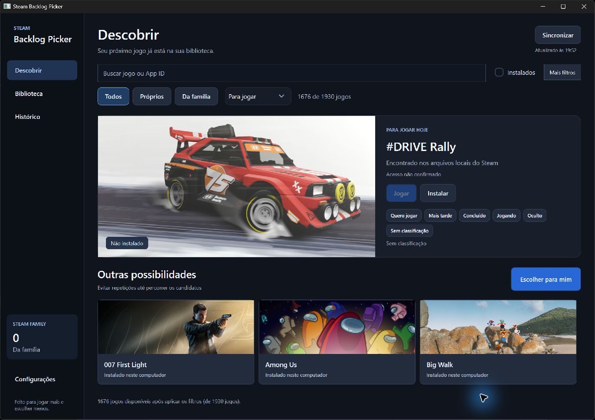
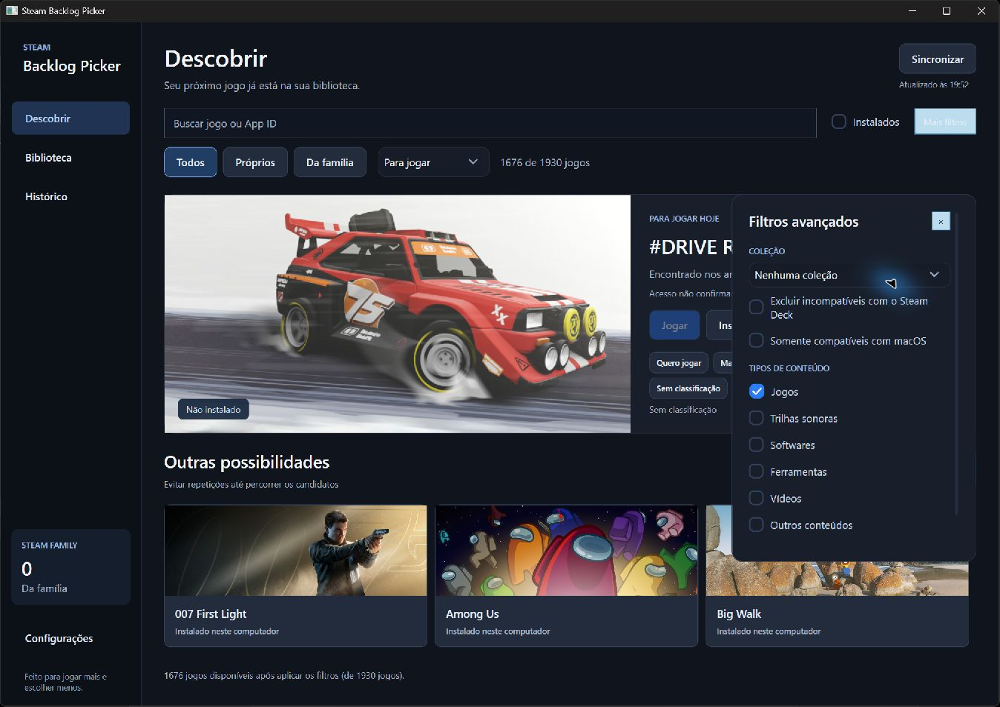
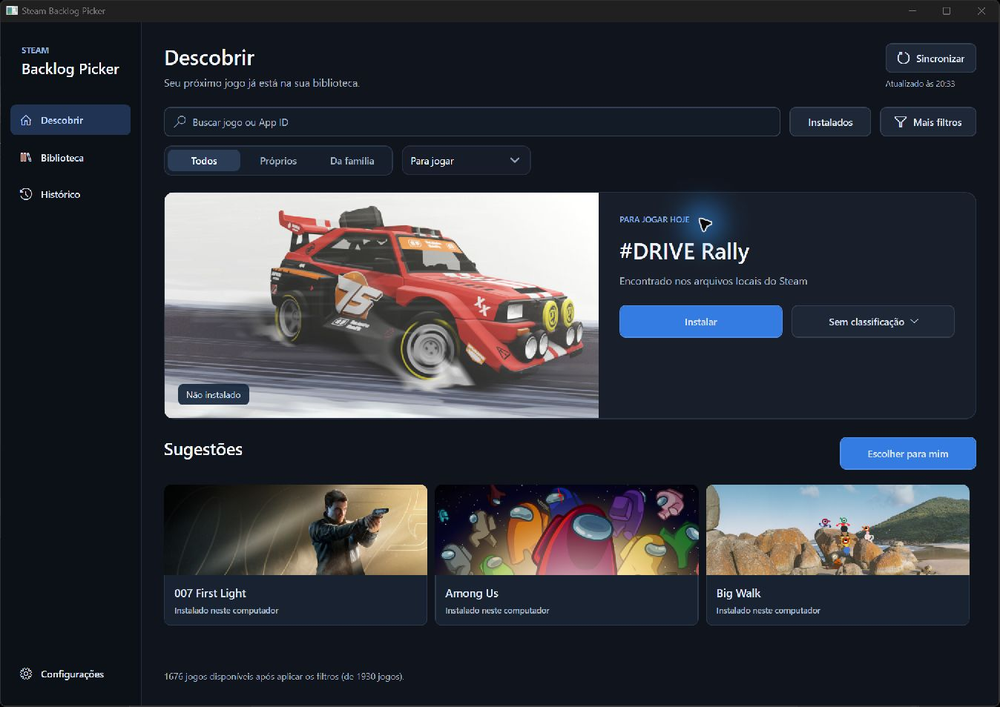
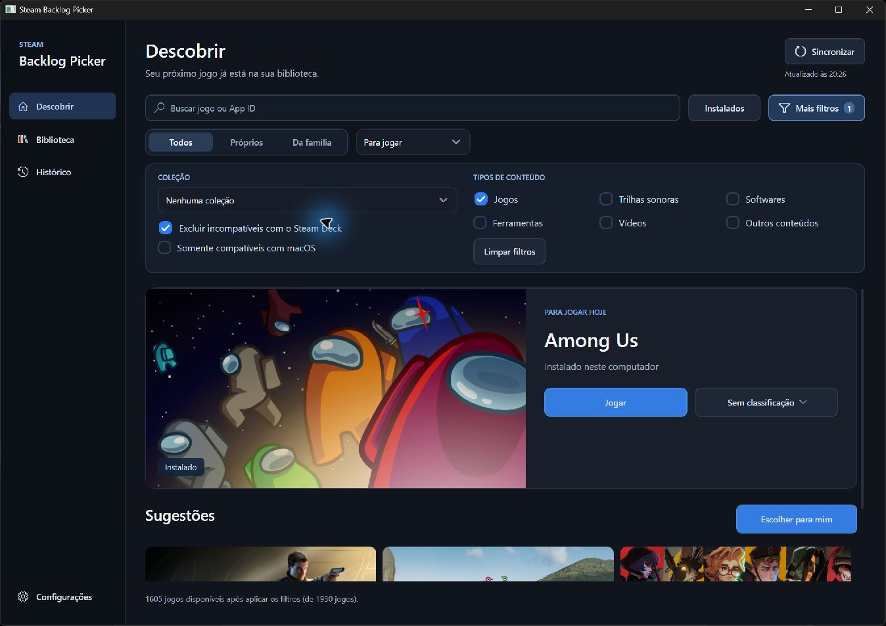
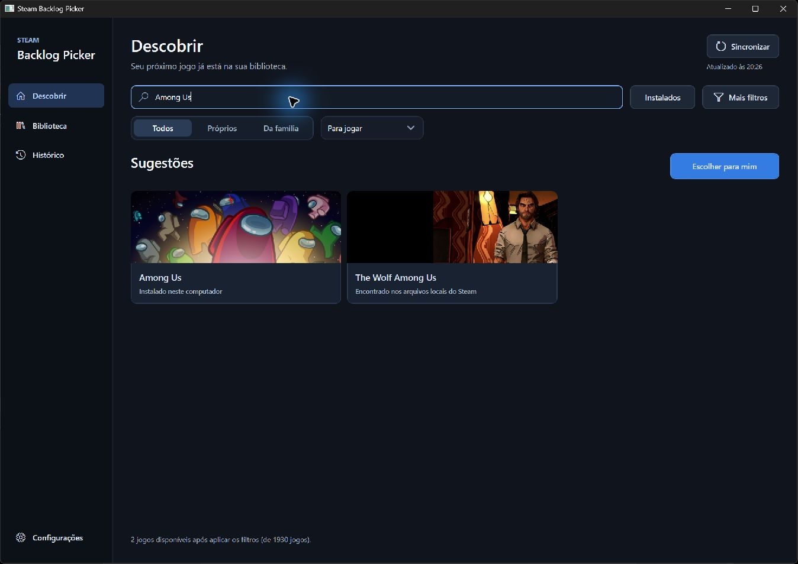
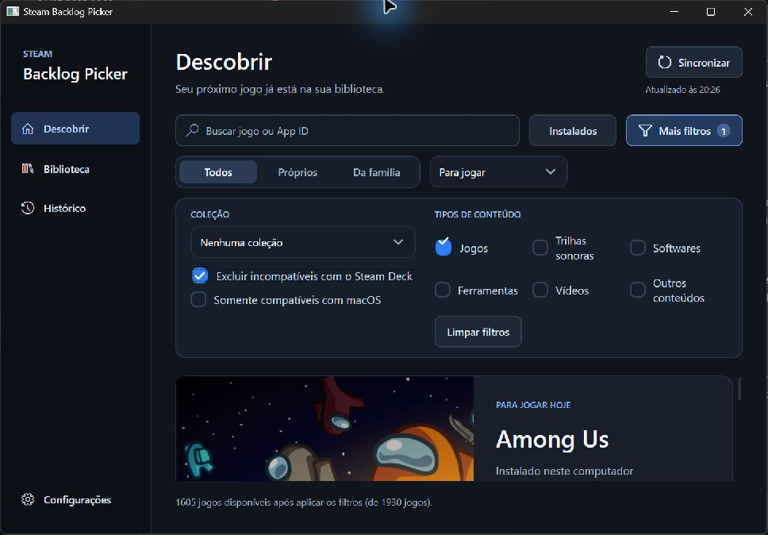
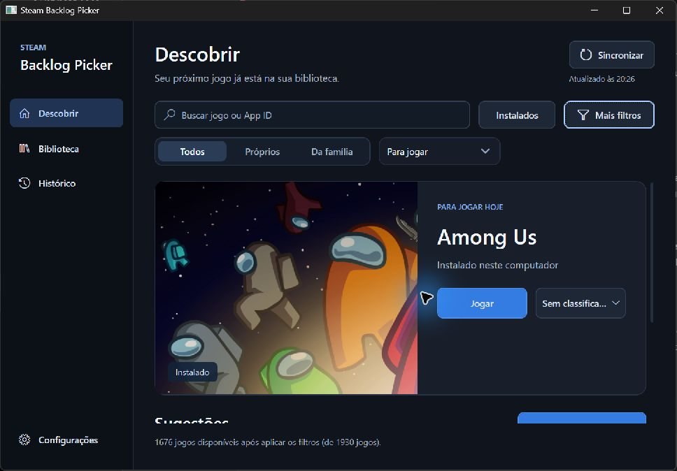
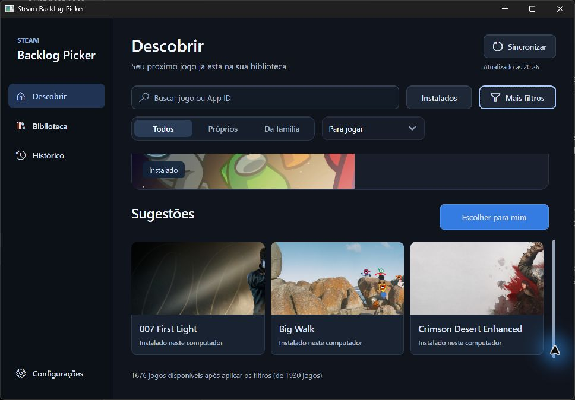
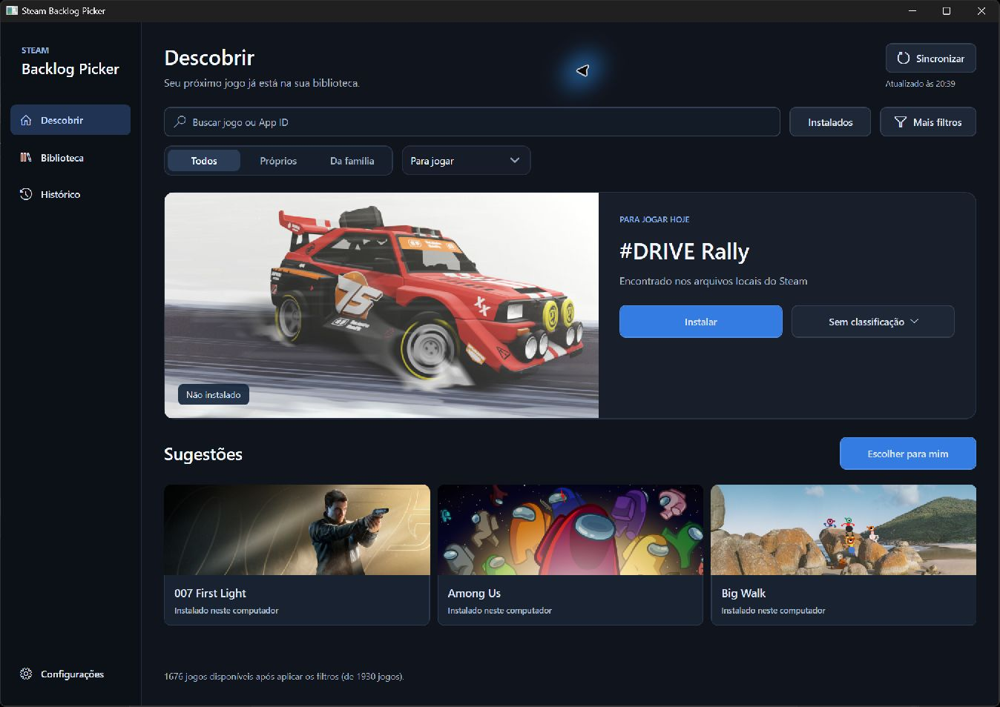

# Refino de interface, regressões e performance

Continuação da implementação de 6 de setembro de 2026. O pedido foi tornar a interface menos rígida, corrigir assimetrias, retirar redundâncias, adicionar microinterações e revisar performance/regressões. As alterações seguem locais, sem publicar uma release.

## Revisão visual e mudanças

1. **Descobrir.** A captura inicial mostra seis botões pequenos de backlog, dois botões de execução/instalação mesmo quando um não pode agir, dois contadores repetidos e um bloco familiar sem função de navegação. O refino remove o bloco familiar e a frase da lateral, mantém um único contador de resultados, reúne o backlog em um menu e mostra a ação de jogar/instalar aplicável. Controles regulares têm 40 px, ações principais 44 px; menu e ação do jogo dividem a mesma largura. Os ícones vêm da fonte Segoe MDL2 Assets do Windows.
2. **Filtros.** Antes, um painel estreito cobria detalhes e ações do jogo. Agora os filtros expandem acima do conteúdo, com coleção/compatibilidade à esquerda e tipos de conteúdo à direita. Origem usa três segmentos iguais; o botão de filtros extras indica quantos grupos estão alterados. Busca, filtros instalados e backlog permanecem acessíveis sem abrir o painel.
3. **Feedback.** Hover de 140 ms, pressão com deslocamento de 1 px em 100 ms e entrada de página/seleção/filtros de 190 ms. Apenas opacidade e transformação visual são animadas. Não há timer ou animação contínua em repouso. Windows `ClientAreaAnimation` e `SBP_REDUCED_MOTION=1` desativam o movimento; ações continuam imediatas. Imagens mantêm recorte arredondado, sem blur/glow por cartão.

### Evidência capturada nesta rodada

Antes:

Depois:

Busca com texto legível e filtros na janela mínima de 980 × 680 (a captura exclui parte da moldura nativa):

As capturas mostram dados reais da biblioteca local. Nesta rodada não foi feita nova autenticação familiar; evidência familiar expirada não foi apresentada como direito de acesso atual. Não foi salvo QR, token ou identificador de conta nas capturas.

## Revisão técnica

- **Atualizações redundantes e SQLite:** corrigidas no catálogo/coordenador, com medidas e regressões no [relatório de catálogo](../refinement-catalog.md).
- **Renderização forçada por software:** o teste com aceleração abriu Descobrir e Biblioteca corretamente nesta sessão. WPF voltou a escolher automaticamente seu modo; `SBP_SOFTWARE_RENDERING=1` permanece como alternativa para drivers problemáticos. A janela branca vista na primeira implementação não voltou a ocorrer nesse teste.
- **Freezable em animação:** o primeiro preview deste refino reproduziu uma exceção ao tentar animar um `TranslateTransform` congelado pelo template WPF. A correção clona o transform por controle, preserva o objeto compartilhado e é coberta por um teste STA. Esse preview não é o pacote de entrega.
- **Texto da busca cortado:** o teste nativo encontrou padding duplicado no template do campo. O texto filtrava a biblioteca, mas ficava quase invisível. O template foi corrigido e um teste STA mede o espaço disponível para o texto usando o estilo real do aplicativo.
- **Persistência e concorrência:** entradas nulas no histórico não derrubam a seleção; falhas ao salvar restauram o estado anterior. Resultados atrasados de sorteio/sincronização não substituem filtros ou a conta atual. Os testes cobrem essas regressões.
- A revisão adicional cobre miniaturas, reconstruções de listas e persistência; o resultado detalhado fica no [relatório de performance](../refinement-performance.md).
- O [relatório Avalonia](../refinement-linux.md) registra a interface Linux e seus testes com controles reais em modo headless.

### Medidas controladas do catálogo

Mesma máquina, .NET 8 Release, fixture com 2.000 jogos. Leituras sem rede, banco já preenchido. Tempos são diagnósticos de uma execução; não representam um benchmark estatístico nem o tempo total de inicialização do programa.

| Medida | Antes | Depois |
| --- | ---: | ---: |
| Eventos de biblioteca num refresh sem mudanças | 102 | 1 |
| Eventos de status | 104 | 4 |
| Leitura SQLite offline | 1.295 ms | 87 ms |
| Alocação na leitura SQLite | 13,85 MB | 4,78 MB |

No cenário controlado de 1.930 jogos e 40 buscas, a alocação caiu de 10,14 MB para 4,61 MB (54,5%) e as consultas ao localizador de imagens durante a busca passaram de 57.220 para zero. Cartões e listas estáveis são reaproveitados; miniaturas compartilham imagens decodificadas e o cache em memória tem limites de tamanho e quantidade. Esse cenário usa localizadores simulados e não mede FPS nem a memória total do processo.

As fontes técnicas usadas na implementação foram a documentação Microsoft de [transformações WPF](https://learn.microsoft.com/en-us/dotnet/desktop/wpf/graphics-multimedia/transforms-overview), [layout e performance](https://learn.microsoft.com/en-us/dotnet/desktop/wpf/advanced/optimizing-performance-layout-and-design) e [ícones Segoe](https://learn.microsoft.com/en-us/windows/apps/design/iconography/segoe-ui-symbol-font). A medição acima veio dos testes do repositório.

## Validação de entrega

- Compilação da solução em Release com avisos tratados como erros: zero avisos e zero erros.
- Suíte completa após o ajuste final: **355 aprovados, zero falhas, 11 ignorados** por dependerem de Linux; 366 execuções ao contar os múltiplos frameworks. [Resumo por suíte](test-summary.json).
- Computer Use no Windows com a biblioteca real de 1.930 entradas: navegação, busca, menu de backlog, classificação e desfazer. No executável final, a busca por “Among Us” mostra dois resultados; selecionar o jogo instalado apresenta “Jogar”. O filtro Steam Deck muda o total de 1.676 para 1.605 e mostra o indicador 1; limpar restaura 1.676 e remove o indicador. Escape fecha o painel. A classificação temporária foi restaurada; não foi necessária uma nova autenticação Steam.
- Janela Windows reduzida a 980 × 680 por Computer Use: rótulos dos filtros quebram linha, ações continuam acessíveis e o conteúdo tem rolagem vertical. O menu de backlog preserva o rótulo completo mesmo quando seu botão usa reticências. A interface com filtros abertos oferece menos espaço vertical para o jogo; recolher o painel devolve esse espaço.
- O pacote foi iniciado com `DOTNET_ROOT` vazio, usando o runtime incluído no diretório portátil.
- Avalonia: controles reais em modo headless, incluindo tamanho mínimo, filtros, menus e virtualização de 5.000 jogos. Execução nativa Linux permanece fora desta validação.
- Pacote Windows portátil com runtime .NET incluído. O ZIP é uma versão local de teste, `0.0.0`, sem assinatura ou publicação de release. [Hash e tamanho verificados](package-verification.json).

Limites: execução nativa Linux/macOS e auditoria completa com leitor de tela permanecem dependentes desses ambientes. A nova experiência continua em WPF/Avalonia; o SwiftUI não recebeu esse redesenho. Não foram instalados nem iniciados jogos durante o teste de UI.

## Ajuste posterior — alinhamento das sugestões

O screenshot enviado pelo usuário mostrou a margem de 10 px sobrando depois do último card. A grade WPF/Avalonia agora compensa essa margem externa: os três cards continuam com larguras iguais e intervalos de 10 px, e o último termina na mesma borda do bloco superior e do botão de sorteio. O título WPF também foi centralizado verticalmente na linha do botão.

Validação deste ajuste: build Release da solução com zero avisos/erros; nove testes existentes de apresentação Avalonia aprovados; inspeção por Computer Use do novo executável Windows. Nenhuma lógica de seleção ou filtros foi alterada. O pacote atualizado está em `artifacts/release/windows-aligned/SteamBacklogPicker-0.0.0-win-x64.zip`, com 83.497.956 bytes e SHA-256 verificado `a47b3c24b2d8e2623650ce5fc797af2bf5471ed7a9215278a8a435b840625869`.

